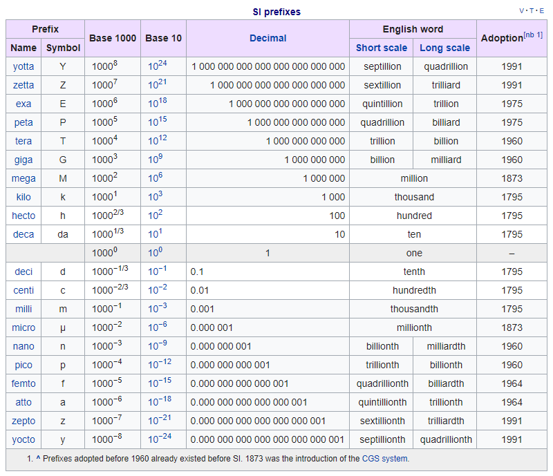
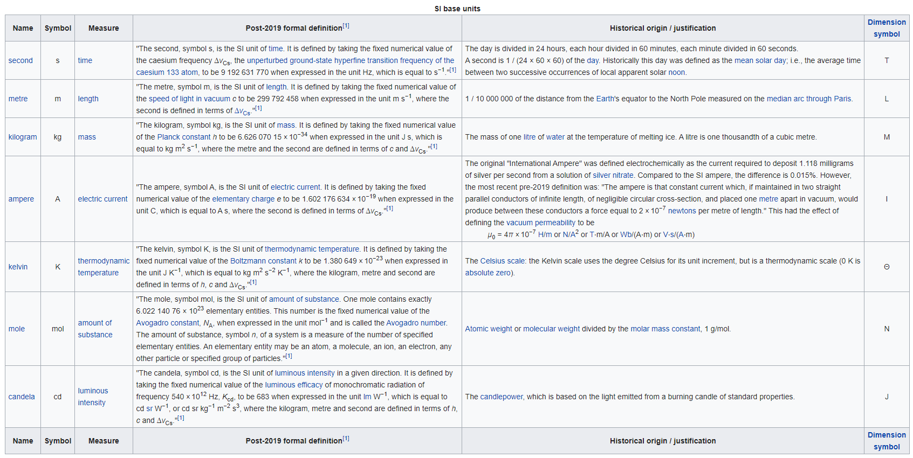
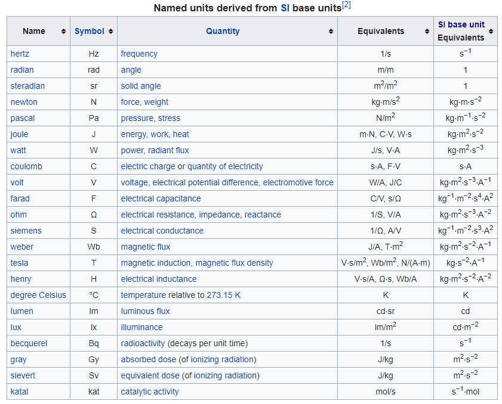
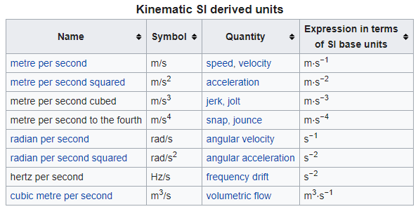
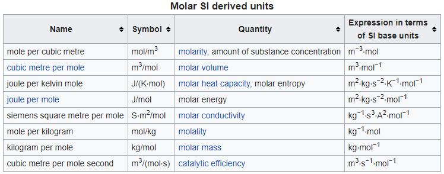
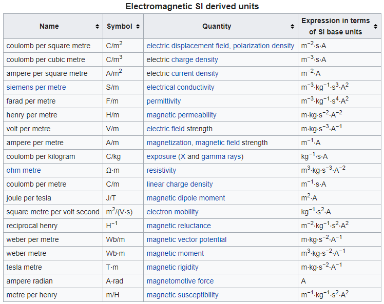
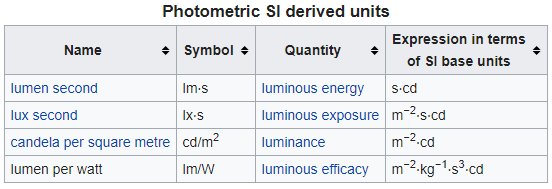
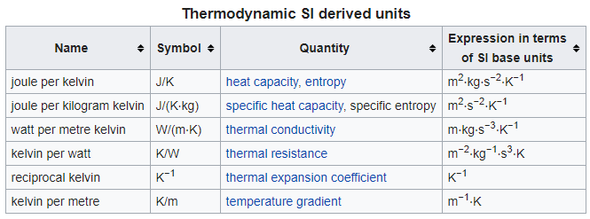
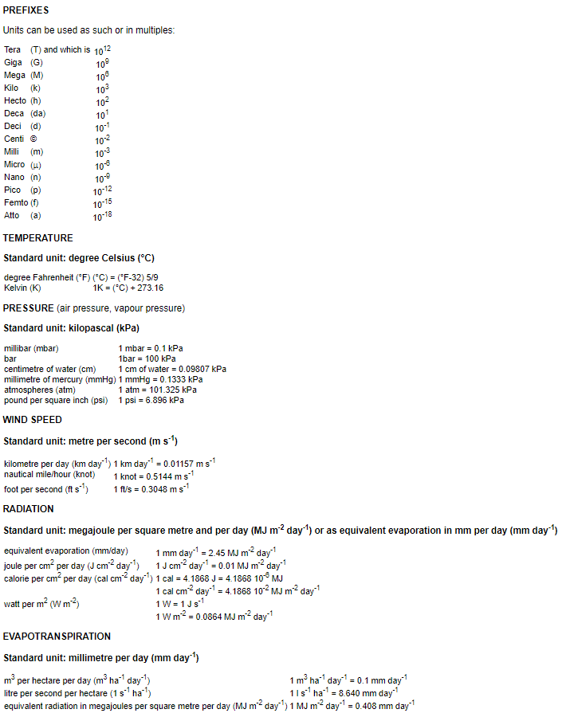

# 00-Support.Data.Units

**TOC**

  - [Standard](#standard)
  - [Resources](#resources)
  - [Examples](#examples)

## Standard

**SI: The International System of Units**

**FAO**

## Resources

SI

  - [SI Prefix](https://en.wikipedia.org/wiki/Metric_prefix)
  - [SI Base Units](https://en.wikipedia.org/wiki/SI_base_unit)
  - [SI Derived Units](https://en.wikipedia.org/wiki/SI_derived_unit)

FAO

  - [FAO](http://www.fao.org/3/X0490E/x0490e0i.htm)

## [Examples](examples/README.md#units)
