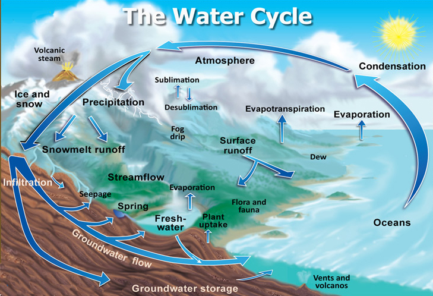

# IHEWAstandard.Engine

Define the **Engine standard** of WaterAccounting Tools.

## [API](./API.md)

## [Data](./Data.md)

## Hydrology

[Wikipedia](https://en.wikipedia.org/wiki/Water_cycle)

[NOAA](https://www.nwrfc.noaa.gov/info/water_cycle/hydrology.cgi)

